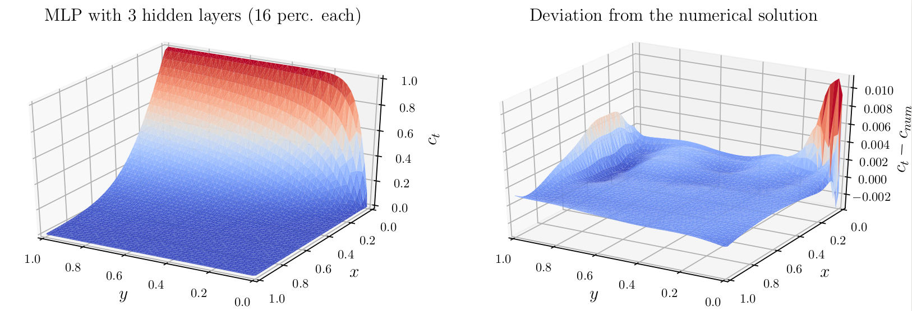

# Machine Learning - Capstone project
## Using multilayer perceptrons to approximate the solution of partial differential equations

This repository contains all files related to my capstone project for the [Machine Learning Nanodegree](https://www.udacity.com/course/machine-learning-engineer-nanodegree--nd009t) by Udacity. I followed two approaches to construct approximate solutions for [Initial](https://en.wikipedia.org/wiki/Initial_value_problem)-[Boundary](https://en.wikipedia.org/wiki/Boundary_value_problem)-Value (IBV) problems:
* **Supervised learning**: the numerical solution can be seen as set of feature/label pairs. The loss function is defined such that the difference between the MLP evaluated at the discrete mesh locations, and the numerical solution, calculated beforehand, becomes minimal.
* **Partial derivatives of the MLP**: because the MLP is always a continuous, smooth function, its gradient with respect to the input features can be computed. The loss function is then defined such that the residual of the approximated partial derivatives forming the differential equation becomes minimal.

A more detailed description of the basic ideas can be found in the *capstone_report.pdf* document. The maximum error of the final model is about one percent.

## Files and folders
- *pdeUtils.py*: implementation of the neural network, custom functions, error norms, and complementary functions
- *visuals.py*: contains a function to visualize the approximate solution and its deviation from a given reference as surface plots
- *fullRawData*: contains the training data including boundary points
- *internalRawData*: contains the training data without boundary points
- *capstone_baseline.ipynb*: notebook with tests performed on the baseline model
- *network_arch_test.ipynb*: notebook to test different network architectures
- pureNetwork*, trialFunction*, customFunction*: folders which contain final weights and biases for different Python models
- keras: folder which contains the weights and biases of all keras models
- the initial capstone proposal and the final report

## Libraries
* [Keras](https://github.com/HIPS/autograd) with [Tensorflow](https://www.tensorflow.org/) backend: For the standard supervised learning based on feature-label pairs I used simple Keras models.
* [Autograd](https://github.com/HIPS/autograd): For the networks I implemented from scratch, Autograd is used to compute higher order derivative with respect to the inputs, and also to compute the derivative of the loss function with respect to the network weights.

## License
MIT License

Copyright (c) 2018 Andre Weiner

Permission is hereby granted, free of charge, to any person obtaining a copy
of this software and associated documentation files (the "Software"), to deal
in the Software without restriction, including without limitation the rights
to use, copy, modify, merge, publish, distribute, sublicense, and/or sell
copies of the Software, and to permit persons to whom the Software is
furnished to do so, subject to the following conditions:

The above copyright notice and this permission notice shall be included in all
copies or substantial portions of the Software.

THE SOFTWARE IS PROVIDED "AS IS", WITHOUT WARRANTY OF ANY KIND, EXPRESS OR
IMPLIED, INCLUDING BUT NOT LIMITED TO THE WARRANTIES OF MERCHANTABILITY,
FITNESS FOR A PARTICULAR PURPOSE AND NONINFRINGEMENT. IN NO EVENT SHALL THE
AUTHORS OR COPYRIGHT HOLDERS BE LIABLE FOR ANY CLAIM, DAMAGES OR OTHER
LIABILITY, WHETHER IN AN ACTION OF CONTRACT, TORT OR OTHERWISE, ARISING FROM,
OUT OF OR IN CONNECTION WITH THE SOFTWARE OR THE USE OR OTHER DEALINGS IN THE
SOFTWARE.
